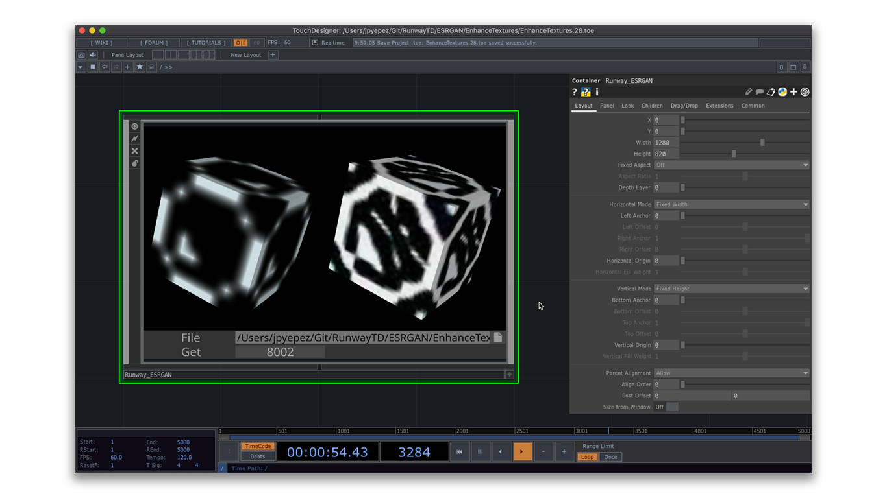

# Enhance Textures

Generation of realistic textures using **ESRGAN** models for image
super-resolution. This example reads low resolution textures, enhances
them, and sends its output to TouchDesigner.

### Running the Example

* Download the project folder.
* Open Runway and create a workspace with the ESRGAN model. Check the [docs](https://docs.runwayapp.ai/#/) for tutorials and additional information.
* Select **File** as input, and open the included `images` folder.
* Select **Network** as output and run the model.
* Open the **EnhanceTextures.toe** file and press 'F1' to enter performance mode.
* Click on the `Get` field and input the port from Runway's HTTP
  server (e.g. `8000`).
* **Selecting a texture:** 
  1. In Runway: Select the texture to enhance from the input list.
  2. In Touchdesigner: Click on the folder icon 📂 next to the
   `File` field and select the same texture. This operation will load
   the original file and receive the enhanced texture from Runway.
  3. Repeat steps i. and ii. to load different textures.
* Press 'Esc' to leave performance mode.

**Notes:** 
* At the moment, Touchdesigner requires selecting the texture in both
  apps. Future Runway features should facilitate simpler interaction
  flows.
* Keep an eye on the output folder (`ESRGAN`), which will auto-save
  the enhanced textures.
* If you have any issues, press `Alt+T` and check the python console.
* The textures in the `images` folder are part of the [mini8x texture pack](https://forum.minetest.net/viewtopic.php?f=4&t=14633) by [D00Med](https://github.com/D00Med) (Licensed under CC-BY-SA 3.0).

### Add Your Own Images

* Simply add your own texture files to the `images` folder.
* Alternatively, select a texture in a different location in both
  Runway and Touchdesigner.
