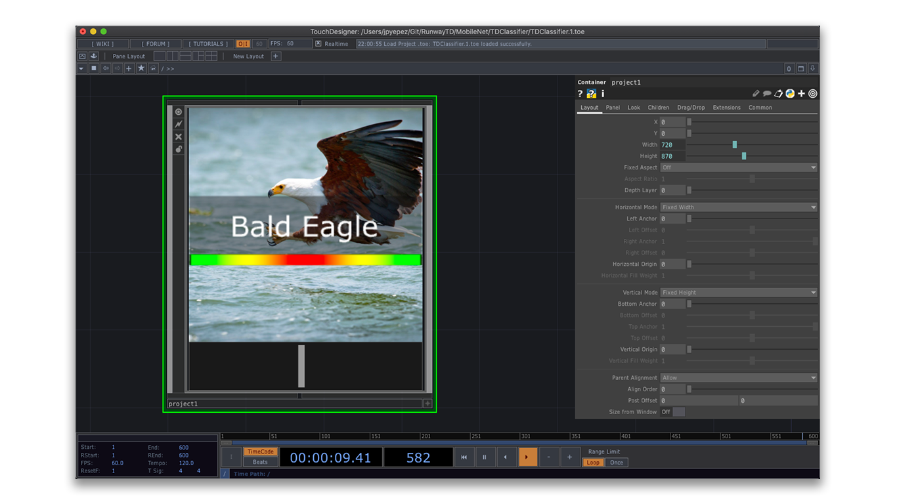

# TDClassifier

Image classification in Runway using **MobileNet** and Touchdesigner.
This example generates a simple user interface to display images and their corresponding labels (exported from Runway).

### Running the Example

* Open the **TDClassifier.toe** file and press 'F1' to enter performance mode.
* Use the slider to scroll through the image list.
* Press 'Esc' to leave performance mode.

### Add Your Own Image Folder

* Use Runway and MobileNet to classify all your images and generate a JSON file.
* Put all your images and the JSON file to a folder.
* Open the **TDClassifier.toe** file. Navigate to **project1/display**.
* Select the **data DAT** and replace the file with your JSON file.
* Click on the **Reload** button.
* **The project includes a 'Fruit' and 'Animals' folder for you to try this**.

