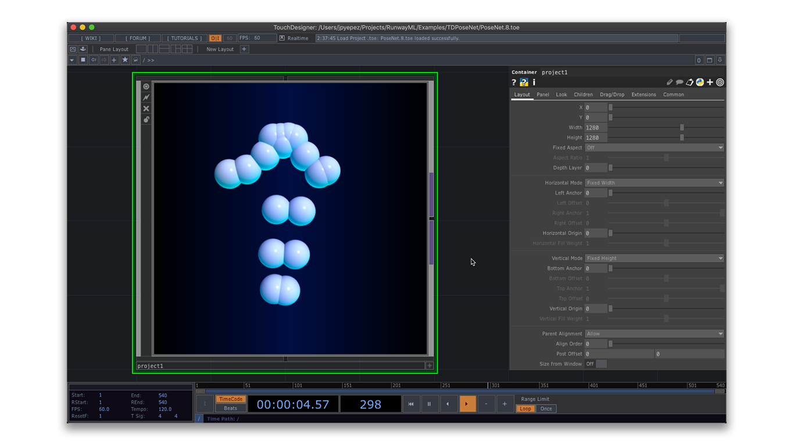

# TDPoseNet

**PoseNet** estimates human figures in images and video. This example reads a JSON file from Runway to get the body joint positions, and uses the data to display a dummy in Touchdesigner.

### Running the Example

* Download the project folder.
* Open the *TDPoseNet.toe* file in Touchdesigner and press `F1`.
* Press `Esc` to leave performance mode.

### Loading Data Files

* Copy the JSON file with the pose data to the project folder, or use a file in a different location.
* Navigate into the `project1` COMP.
* Select the `data` DAT and load the JSON file on the `File` parameter. *Click on the `Pulse` button next to the `Load on Start` parameter*.
* Pose data ranges might vary considerably across different images or video. Select the `mathX` and `mathY` CHOPS, and adjust the `To Range` parameters to move the dummy to the desired coordinate position.

### Creating Your Own Data Files

* You may use the PoseNet model in Runway to generate new JSON files. Check the [docs](https://docs.runwayapp.ai/#/) for tutorials and demos.