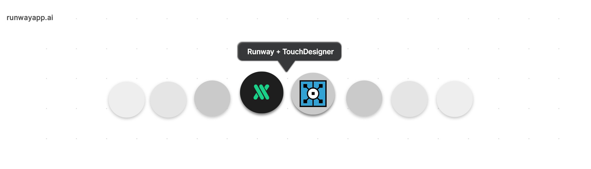

  

# RunwayML + TouchDesigner

A collection of examples and tutorials on how to use [Runway](https://runwayapp.ai/) with [TouchDesigner](https://www.derivative.ca/).

More RunwayML networking examples [here](https://learn.runwayml.com/#/networking/examples).

🎉Community Contribution

## Examples

### HTTP
* [Image Classification with MobileNet](MobileNet/TDClassifier), an example by [JP Yepez](https://www.jpyepez.com) 🎉
* [Upscale Images and Enhance Textures with ESRGAN](ESRGAN/EnhanceTextures), an example by [JP Yepez](https://www.jpyepez.com) 🎉

## Contributing

This is still a work in progress. Contributions are welcomed!

