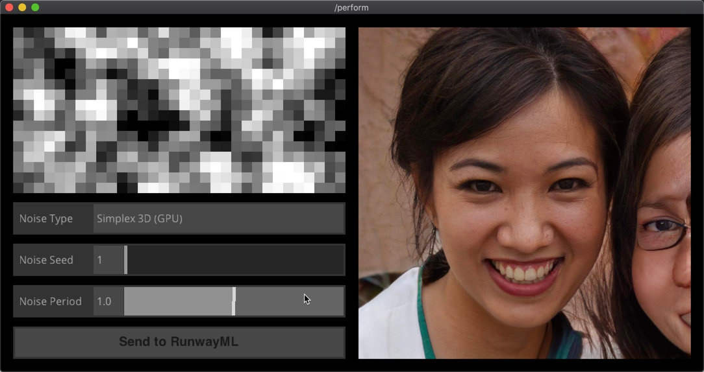

# TDVector

Generation of photorealistic high-quality images using **StyleGAN2**.
This Touchdesigner example uses a simple UI to manipulate and send a noise
texture to RunwayML. Once received, StyleGAN2 will generate
state-of-the-art images from various available categories (human
faces, cats, cars, and so forth).

### Requirements:
Requires Touchdesigner (2020 builds, SocketIO DAT added)

### Using Vectors as Data Type:
This example will also work for any **vector-based models** (i.e. an
array of floats as input).

### Running the Example

* Download the project folder.
* Open RunwayML and create a workspace with the StyleGAN2 model. Check
  [RunwayML Learn](https://learn.runwayml.com/#/) for tutorials and
  additional information.
* Select **Network** and **Socket.io** to review the Socket.IO Server details.
* Run the model.
* Make sure your model is listening to port `3000` (should be the
  default port of the server address, as long as it is the only model
  currently running).
* Open the **TDVector.toe** file and press 'F1' to enter performance mode.
* Use the UI to generate a noise texture and click on `Send to
  RunwayML` when ready.
* Wait for StyleGAN2 to generate the image, which will be sent back to
  the TDVector example.
* Press 'Esc' to leave performance mode.

